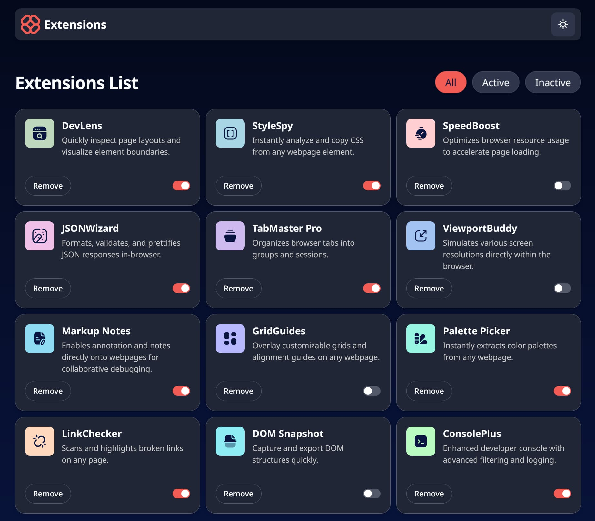
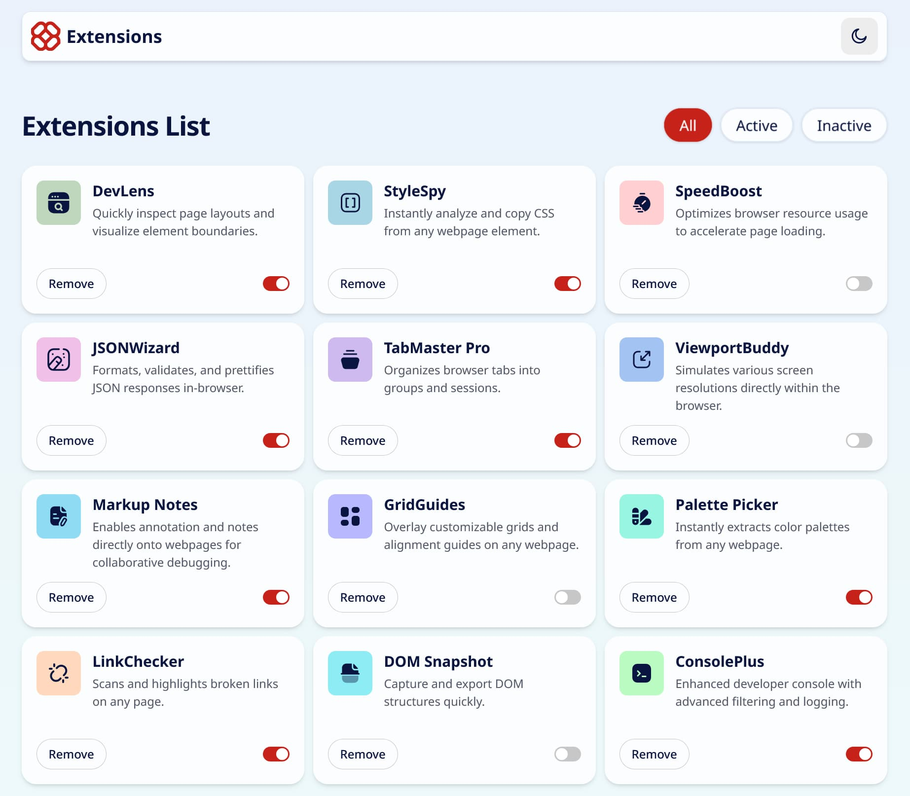

# Browser Extensions Manager UI

A responsive web browser extensions manager UI that allows users to toggle extensions between active and inactive states, filter extensions based on state, remove extensions, and select a preferred light or dark theme.

This is a solution to the [Browser extensions manager UI challenge on Frontend Mentor](https://www.frontendmentor.io/challenges/browser-extension-manager-ui-yNZnOfsMAp). Frontend Mentor challenges help you improve your coding skills by building realistic projects. 
## Table of contents

- [Overview](#overview)
  - [The challenge](#the-challenge)
  - [Screenshot](#screenshot)
  - [Links](#links)
- [My process](#my-process)
  - [Built with](#built-with)
  - [Architecture & Key Decisions](#architecture--key-decisions)
  - [Data flow](#data-flow)
  - [State management](#state-management)
  - [Accessibility](#accessibility)
  - [Useful resources](#useful-resources)
- [Author](#author)

## Overview

### The challenge

Users should be able to:

- Toggle extensions between active and inactive states
- Filter active and inactive extensions
- Remove extensions from the list
- Select their color theme
- View the optimal layout for the interface depending on their device's screen size
- See hover and focus states for all interactive elements on the page

### Screenshot





### Links

- [Frontend Mentor solution page](https://www.frontendmentor.io/solutions/responsive-browser-extensions-manager-ui-built-with-react-sXZbYJiswa)
- [live demo site](https://browser-extensions-mgr.vercel.app/)

## My process

### Built with

- Semantic HTML5 markup
- Accessible design principles
- Flexbox
- CSS Grid
- Mobile-first workflow
- JavaScript (ES6+)
- Local JSON data
- [Tailwindcss](https://tailwindcss.com/) - CSS framework
- [Vite](https://vite.dev/) - Frontend build tool
- [React](https://reactjs.org/) - JS library

### Architecture & Key Decisions

Application state and update logic are all handled at the `App` level and within the themeing system using `Context`. Presentational, reusable components receive data via props; application state remains centralized in the parent component.

```
src/
├── components/
│   ├── ControlBar.jsx       # Secondary heading, container for filter options
│   ├── ExtensionCard.jsx    # Extension card containing all base markup and style classes
│   ├── FilterButton.jsx     # Button component to handle markup and specific conditional styles 
│   ├── Header.jsx           # Primary heading, theme toggle button
│   ├── Switch.jsx           # Toggle switch component, rendered within ExtensionCard
│   └── ThemeToggle.jsx      # Light-Dark theme button
├── contexts/
│   └── ThemeContext.jsx     # Theme context source
│   └── ThemeProvider.jsx    # Theme provider logic with localStorage
├── App.jsx
├── main.jsx
└── index.css
```

### Data Flow

This simple app adheres to React's unidirectional data flow with state managed in the parent component and user interactions communicated upward via callback props.

### State Management

Besides the Theme management system, I utilized just two simple pieces of state at the top-level `App` using the `useState` hook: `extensions` to serve as the single source of truth, initialized as the local JSON data file, and `filter` to handle the extension view filters. 

```js
const [extensions, setExtensions] = useState(extenstionsData);
const [filter, setFilter] = useState("all");
```

Derived state was utilized to avoid unnecessary duplication of state or multiple instances of identical array content.

### Accessibility

This is a simple UI, but it contains a lot of opportunities to implement sound web accessibility practices. Along with core semantic HTML markup, I utilized:

- Semantic buttons
- ARIA switch role along with `aria-checked` attributes for toggle switches
- Keyboard accessibility and proper color contrast styling
- Accessible focus styles per the design requirements

There are a lot of variations on how to create and style a user input designed to emulate a toggle switch. In a production environment or otherwise large-scale app, I'd almost certainly reach for a component from one of the better libraries. But this is a small-scale UI project, and I decided to go with a `button` element, based on the example from the [A11Y Style Guide](https://a11y-style-guide.com/style-guide/section-forms.html). This solution felt most natural for this UI and the logic it needed to support.

```js
function Switch({ checked, label, onClick }) {
  return (
    <button
      type="button"
      data-action="aria-switch"
      role="switch"
      aria-label={label}
      aria-checked={checked}
      onClick={onClick}
      className={`relative inline-flex items-center h-5 rounded-full w-9 overflow-hidden cursor-pointer ${checked ? "bg-brand-red-700 dark:bg-brand-red-400" : "bg-brand-neutral-300 dark:bg-brand-neutral-600"} focus-visible:outline-2 focus-visible:outline-offset-2 focus-visible:outline-brand-red-500 dark:focus-visible:outline-brand-red-400 transition-colors duration-200`}>
      <span
        className={`absolute inline-block size-4 bg-white rounded-full pointer-events-none ${checked ? "translate-x-4.5" : "translate-x-0.5"} transition-transform duration-200`}></span>
    </button>
  );
}
```

### Useful resources

- [A11Y Style Guide](https://a11y-style-guide.com/style-guide/section-forms.html) - This is generally a great resource for looking up all sorts of accessibility-related topics. I particularly appreciate how easy it is to navigate and find what I'm looking for. The section on Toggles helped a lot in streamlining my toggle switch markup and styles.
- [React theming (dark mode) with Context API and Tailwind CSS](https://medium.com/@sandeepshome.dev/react-theming-dark-mode-with-context-api-and-tailwindcss-b3ef50a9522b) - There are a lot of small variations out there around how folks are implementing theme toggling with React Context. Each time I build a theme toggle, I feel it's just a bit different from the last. This is a nicely written and recent article on the topic.

## Author

- Website - [Matt Pahuta](https://www.mattpahuta.dev)
- Frontend Mentor - [@mattpahuta](https://www.frontendmentor.io/profile/MattPahuta)
- Bluesky - [@mattpahuta](https://bsky.app/profile/mattpahuta.bsky.social)
- LinkedIn - [Matt Pahuta](www.linkedin.com/in/mattpahuta)
